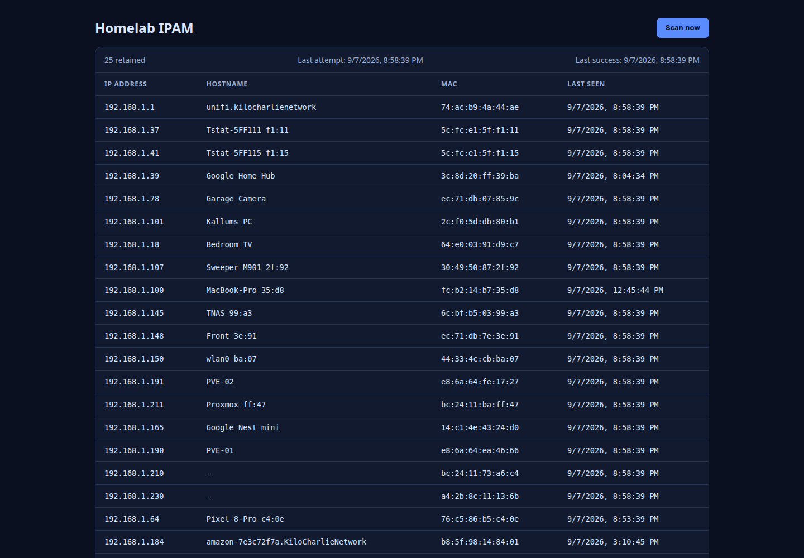

# Homelab IPAM

<p align="center">
  
</p>

<p align="center">
  A lightweight, self-hosted LAN IP address management dashboard for Docker.
</p>

Homelab IPAM scans the local network, keeps recently seen devices available, and provides a simple web interface for viewing results or starting a manual scan.

## Features

- Automatic LAN scan every 5 minutes
- Removes an entry only after it has been absent for 48 hours
- Manual “Scan now” button
- Optional UniFi hostname enrichment
- Reverse DNS hostname fallback
- Previously known hostnames are preserved if a later lookup fails
- The IPAM scan remains usable when hostname lookups fail
- Uses only the `NET_RAW` capability required for network scanning

## Quick start without UniFi

UniFi integration is optional. The basic IPAM scanner works without UniFi.

Clone the repository:

```sh
git clone https://github.com/kallum-cooper/homelab-ipam.git
cd homelab-ipam
```

Start the service:

```sh
docker compose up -d
```

The dashboard listens on port `8787`:

```text
http://YOUR_DOCKER_HOST:8787/
```

The supplied Compose file uses host networking because LAN discovery must run from the Docker host's network namespace.

To update the service later:

```sh
docker compose pull
docker compose up -d
```

## Scan and retention behaviour

### Automatic scans

A scan runs automatically every 5 minutes.

Only one scan is allowed to run at a time. If a scan is already running, another scan request shares the existing scan rather than starting a duplicate.

The scanner has a configurable timeout to prevent a stalled network scan from blocking the service indefinitely.

### Device expiry

A device is removed only when its last successful sighting is at least 48 hours old.

Devices that temporarily disappear from a scan remain visible until this retention period expires.

### Failed scans

If a scan fails, the service keeps the previous scan results and reports the error in its status.

A failed scan does not remove devices or reset the last successful scan timestamp.

## Manual scans

Use the **Scan now** button in the dashboard to start a scan manually.

The button is disabled while a scan is running.

## Optional UniFi hostname enrichment

UniFi integration is optional.

When configured, Homelab IPAM matches scanned devices against UniFi clients using their MAC address. It prefers the friendly name configured in UniFi, followed by the UniFi hostname.

If UniFi is unavailable, not configured, or does not contain a matching device, Homelab IPAM falls back to reverse DNS.

The lookup order is:

1. UniFi friendly name
2. UniFi hostname
3. Reverse DNS hostname
4. Previously stored hostname
5. IP/MAC entry without a hostname

The scan remains usable if all hostname lookups fail.

### Configure UniFi integration

UniFi enrichment requires:

- A UniFi Network application with API access
- A UniFi API key
- The UniFi integration API URL
- The UniFi controller CA certificate when using a private or self-signed certificate

Copy the example environment file:

```sh
cp dev/unifi.env.example unifi.env
chmod 600 unifi.env
```

Edit `unifi.env`:

```env
UNIFI_BASE_URL=https://unifi.local/proxy/network/integration/v1
UNIFI_API_KEY=replace-with-your-unifi-api-key
UNIFI_CA_CERT_PATH=/run/secrets/unifi-ca.pem
```

Save the UniFi controller CA certificate as:

```text
unifi-ca.pem
```

Start IPAM with the UniFi Compose override:

```sh
docker compose -f compose.yml -f dev/compose.unifi.yml up -d
```

The Compose override maps `unifi.local` to `192.168.1.1` by default. Override these values when needed:

```sh
UNIFI_HOSTNAME=unifi.local UNIFI_IP=192.168.1.1 \
  docker compose -f compose.yml -f dev/compose.unifi.yml up -d
```

The certificate must be valid for the hostname used in `UNIFI_BASE_URL`.

### Running without UniFi

The default command remains:

```sh
docker compose up -d
```

No UniFi API key or certificate is required.

Reverse DNS will still be attempted when available.

## Configuration

| Variable | Default | Description |
| --- | --- | --- |
| `IPAM_PORT` | `8787` | HTTP listening port |
| `IPAM_HOST` | `0.0.0.0` | HTTP listening address |
| `IPAM_DATA_PATH` | `/data/ipam-state.json` | Persistent state file |
| `IPAM_SCAN_COMMAND` | `arp-scan` | Scanner executable |
| `IPAM_SCAN_ARGS_JSON` | `["--localnet"]` in Compose | JSON array of scanner arguments |
| `IPAM_SCAN_TIMEOUT_MS` | `30000` | Scan timeout in milliseconds |
| `UNIFI_BASE_URL` | empty | Optional UniFi API base URL |
| `UNIFI_API_KEY` | empty | Optional UniFi API key |
| `UNIFI_CLIENTS_PATH` | empty | Optional complete UniFi clients API path |
| `UNIFI_CA_CERT_PATH` | `/run/secrets/unifi-ca.pem` | UniFi CA certificate path |

## Persistent data

Scan state is stored in:

```text
/data/ipam-state.json
```

The Compose deployment stores this in the named Docker volume:

```text
ipam-data
```

The volume preserves scan history when the container is recreated or upgraded.

## Development

The editable application source and tests are located in `src/`.

The development Dockerfile and example deployment files are located in `dev/`.

Build and run local changes:

```sh
docker compose -f compose.yml -f dev/compose.yml up -d --build
```

Run the test suite directly:

```sh
node --test src/test/*.test.mjs
```

Build the production image manually:

```sh
docker build -t homelab-ipam:local .
```

For systemd-managed deployment, copy the example service file:

```sh
sudo cp dev/ipam.service.example /etc/systemd/system/ipam.service
sudo systemctl enable --now ipam.service
```
